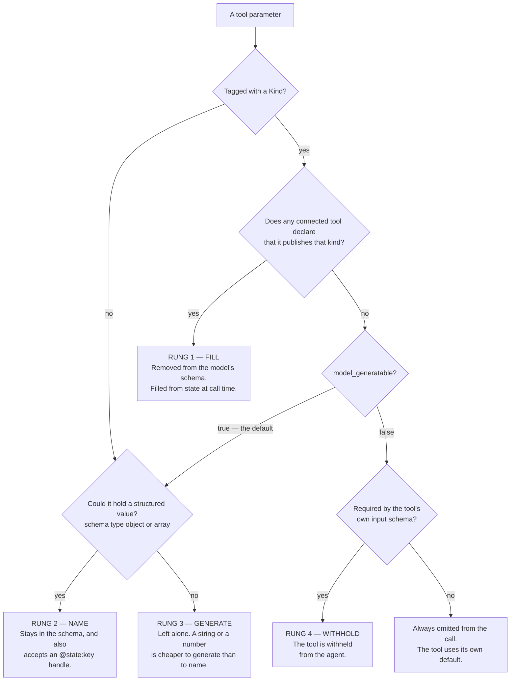
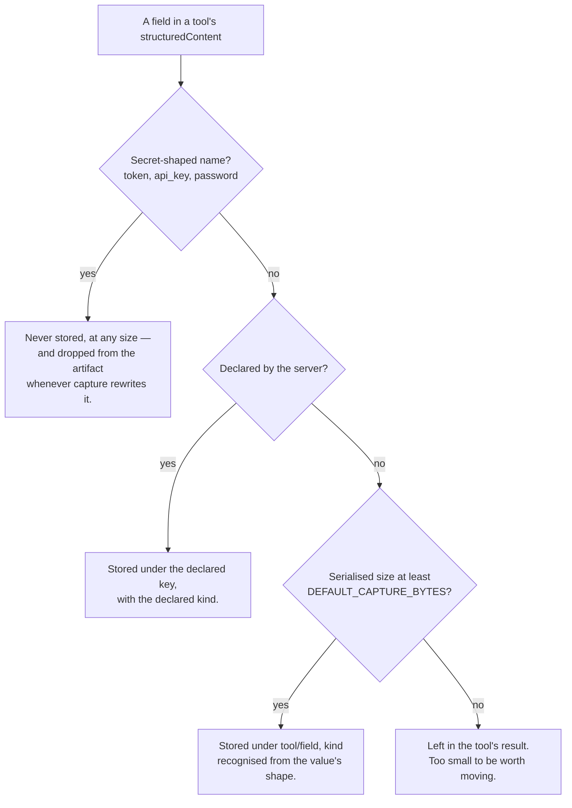
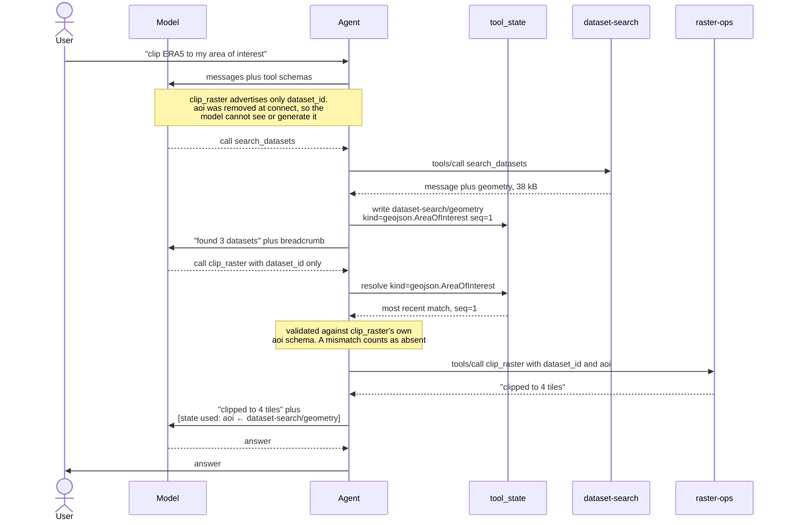
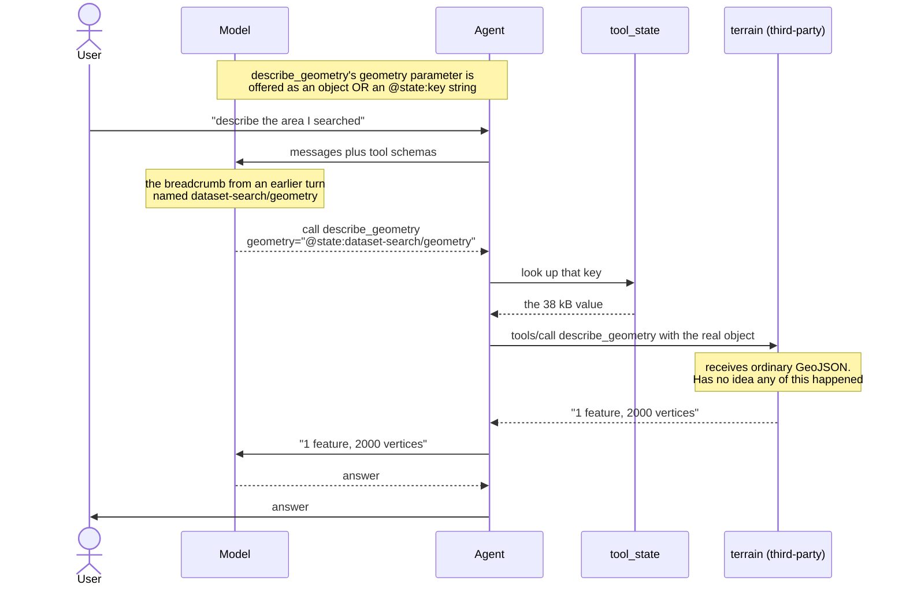
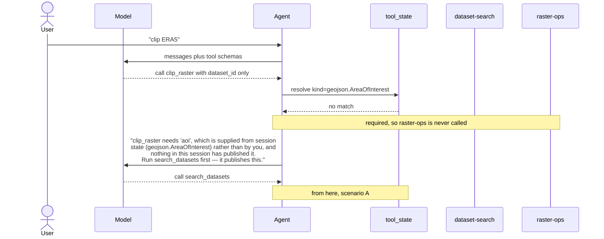
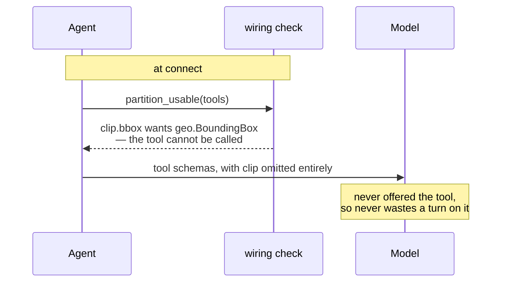

# Session state: what the model never sees

Some tool inputs and outputs are too large for the model to be handling:
a clip geometry, an item collection, a raster footprint. Asking a model to
produce one burns tokens on a value it can only copy imperfectly; letting one
back into the transcript burns tokens on every subsequent turn.

`mcp_state` moves such a value from the tool that produced it to the tool that
needs it, through agent state, without it passing through the model.

## The promise

**Whenever a matching value is in session state, the client's best endeavour is
to get it into the tool call — and to do so in the cheapest way that will
work.**

There is a ladder, tried in order. Each rung has a name, used throughout this
document:

1. **FILL** — *fill it silently.* The parameter is removed from the model's
   schema and filled from state. Costs nothing, and the model cannot get it
   wrong. In the API this path is called **declaration**: a receipt records it
   as `via: "declaration"` (`BY_DECLARATION`).
2. **NAME** — *let the model name it.* The parameter's schema is widened to
   accept a second form: as well as the value itself, it will take the string
   `"@state:dataset-search/geometry"` — a **handle** naming something already in
   session state. The client swaps it for the real value on the way to the
   server. Costs about ten tokens. In the API this path is called **handle**:
   `via: "handle"` (`BY_HANDLE`).
3. **GENERATE** — *let the model generate it.* Ordinary MCP, exactly as if none
   of this existed.
4. **WITHHOLD** — *don't offer the tool.* Only when the tool explicitly said a
   model must not invent the value and nothing can supply it.

**GENERATE** is the baseline, not a failure: most parameters of most tools
should land there, since a string, a number or an enum is cheaper for the model
to write than to name. The other three rungs are about the few that aren't.

**NAME** is available on top of that on any MCP server, with no cooperation
whatsoever *from the server*. **FILL** is the one that needs a tag on the tool —
that is what removes the parameter from the model's schema. **That tag is
entirely optional** — see [What tagging buys you](#what-tagging-buys-you).

A tag alone never costs you a tool. **WITHHOLD** needs the tag *plus* an
explicit `model_generatable=False`, and is the only rung that is opt-in.

The ladder is climbed entirely by the client, so it exists only where
`mcp_state` is wired in. The same servers connected to an MCP host that does
none of this behave exactly as they always did.

### The two paths, side by side

FILL and NAME are the two rungs that put a stored value into a call. Everything
else in this document is about which of them a parameter gets, and what each
one costs. They differ on every axis that matters:

| | **FILL** (`via: "declaration"`) | **NAME** (`via: "handle"`) |
| --- | --- | --- |
| What the consumer must do | Tag the parameter `Kind(...)` | Nothing |
| What the producer must do | Nothing *required* — see below | Nothing |
| What the model is offered | Parameter is **gone** from the schema | Parameter, also accepting `@state:<key>` |
| Who picks the value | The client, by matching kind | The model, by naming a key |
| What the call carries | No such argument at all | `"@state:gazet/aoi"` as the argument |
| What it costs | Nothing | About ten tokens |
| Receipt on the artifact | Key, kind, publishing tool, and `via` | The same four fields |
| Told to the model in content | Yes — `[state used: …]` | No — the model wrote the key itself |
| Works on a third-party server | Only if it tags its parameters | **Yes, on any MCP server** |

**Which side must be tagged, and which need not.** For FILL, the *consumer* is
what matters: the `Kind` tag on the parameter is what removes it from the
model's schema, and without it there is nothing to fill. The *producer* is a
softer requirement, because a stored value gets its kind two ways — from the
publishing tool's own tag, or from
[`detect_kind`](../src/mcp_state/detect.py) reading the value's shape, which
recognises GeoJSON, STAC item collections and bounding boxes from the
discriminators those formats define.

That splits into two questions with two different answers:

- **Which rung a parameter gets** is decided once at connect, from
  *declarations only* — nothing has run yet, so a detected kind is a value that
  may never appear. This is why the wiring check is stricter than runtime; see
  [Sharp edges and limits](#sharp-edges-and-limits).
- **Which stored entry satisfies it** is decided per call, and matches on the
  entry's kind however that kind arose — including a detected one.

So a value from a server that has never heard of this project can satisfy a
tagged parameter at runtime, even though it could not have caused that
parameter to be tagged FILL in the first place.

### What a handle is

"Accepts a handle" is a change to the JSON Schema the *model* sees. A parameter
that could hold a structured value is rewritten into an `anyOf` — its original
schema, or a string beginning `@state:`:

What the server advertises:

```json
{
  "geometry": { "type": "object", "description": "The geometry to describe." }
}
```

What the model is offered:

```json
{
  "geometry": {
    "anyOf": [
      { "type": "object" },
      {
        "type": "string",
        "pattern": "^@state:",
        "description": "A session-state reference, e.g. @state:dataset-search/geometry — the key from a [state updated: …] note. The value is substituted before the tool runs, so prefer this over repeating a large value."
      }
    ],
    "description": "The geometry to describe."
  }
}
```

So the model may still send the whole object; it is *also* allowed to send
`"@state:dataset-search/geometry"` instead. It learns which keys exist from the
`[state updated: …]` breadcrumbs capture leaves in the transcript. Just before
the call, `dereference` replaces any argument starting with `@state:` with the
stored value, so **the server receives ordinary GeoJSON and never learns a
handle was involved** — which is why this needs no cooperation from it.

Two consequences worth knowing up front. Handles are offered on *type*, not on
size — this runs at connect, when nothing has been produced to measure — so a
small object gets the branch too, costing a few schema tokens. And because the
parameter is still in the model's schema, a model determined to inline a
geometry can; NAME makes the cheap path available, where FILL makes it the
only one.

### A handle only counts as a whole argument

Substitution replaces an argument, not a field inside one. A handle written
into a nested field — `request.area`, on a tool taking an opaque
`dict[str, Any]` — is not substituted, and a permissive schema will not reject
it either, so before this guard the literal `@state:…` string reached the
server and came back as a vendor error quoting our own prefix.

The call is now refused instead, naming the path and what is in state:

```
submit_request was not called. Unresolved session-state references:
  request.area: @state:gazet/aoi — a handle is substituted only where it is a
  whole argument, never inside one, so this would have reached the tool as text.
Read a value with inspect_state and write the field yourself, or call the tool
that produces it first.
  @state:gazet/aoi — geojson.AreaOfInterest, 1 feature(s), 2000 vertices, from get_aoi
```

The same check catches a handle naming a key nothing published. If a nested
field genuinely wants a stored value, that is a signal the tool should take it
as a parameter of its own and tag it with a `Kind` — a field inside an opaque
dict is reachable by neither path.

---

## How a parameter is decided

Once, at connect, for every parameter of every connected tool:



Note the path from `model_generatable: true` back into the structured check. A
tagged parameter whose kind nobody publishes does not merely fall back to the
model — it falls back to **NAME**, so the model can still point it at a
stored value by name. Degrading never skips a rung.

**"Structured" is a test on the declared type, not on any value's size** —
this runs at connect, when no tool has produced anything to measure. `object`
and `array` qualify; `string`, `number` and `boolean` do not, since naming a
short value costs a model no less than emitting it. A parameter with no stated
type, or one behind a `$ref` or an `anyOf`, also qualifies: unconstrained means
it could hold anything. The test errs towards yes, because a false yes costs a
few schema tokens while a false no would quietly remove the mechanism from a
parameter that needed it.

Capture, below, is the opposite: it has the value in hand, so it weighs it.

## How a returned value is captured

After every tool call:



The payload is gone from the transcript; what stands in its place is whatever
the tool put in `message`, plus a `[state updated: …]` breadcrumb naming the
key — which is how the model learns what it can point a handle at. The size
gate is an argument, not a constant: `StateCaptureMiddleware(capture_undeclared=…)`
takes a different threshold, or `None` to capture only what a server declared.

## Receipts: the other direction

A FILL is invisible from the transcript alone. The parameter was removed from
the schema at connect, so the tool call the model produced does not mention it,
and the result says nothing about which stored value it ran against.

So every parameter session state supplies — by **either** path — leaves a
**receipt** on the tool message's artifact, under `injected_state`:

```json
{"aoi": {"key": "dataset-search/geometry", "via": "declaration",
         "kind": "geojson.AreaOfInterest", "tool": "search_datasets"}}
```

The key, the kind, the tool that published it, and `via` — `declaration` for a
FILL, `handle` for a NAME. This is a **host-side** record: LangChain sends a
tool message's `content` to the model, never its `artifact`, so nothing here
costs context. It rides the message into the checkpointer and comes back on a
later turn; `receipts_of(message.artifact)` is how a host reads it, and what
`mcp_agent` builds its tool-step input from.

What the model sees is a *second*, shorter copy — and only of the FILL ones —
in the message content, beside the `[state updated: …]` note:

```
Clipped chirps-daily to a 2000-vertex area of interest.

[state used: aoi ← dataset-search/geometry, published by search_datasets]
```

So the two paths are recorded identically; what differs is whether the model is
also told. Two things depend on it being told. Where several stored values
share a kind, resolution takes the most recent — without the note the model
cannot tell which it was given, so it can neither correct a wrong pick nor
describe the result accurately. And the transcript is what the model reads back
when asked how a result came about, so the note is what makes a chain of tools
traceable end to end.

A NAME resolution gets no such note, because the model wrote `@state:<key>`
itself: the key is already in the tool call arguments, and repeating it would
buy nothing the transcript does not already hold.

---

# The scenarios

## A. Both ends tagged — nothing reaches the model

`search_datasets` tags its `geometry` output; `clip_raster` tags its `aoi`
parameter with the same kind. Neither names the other, and they are served by
different MCP servers.



**FILL.** The model spent zero tokens on the geometry and had no opportunity
to get it wrong.

## B. Nothing tagged anywhere — a third-party server

A raw FastMCP server with no `_meta`, no `ToolResult`, and no import from this
project. `describe_geometry(geometry: dict)` advertises
`{"type": "object"}` — which matches every JSON object ever written, so no
client could work out that it wants an area of interest.



**NAME.** About ten tokens instead of 38 kB, and the server was never
modified. Capture works the same way in reverse: `elevation_profile` returns a
55 kB array nobody declared, and it is stored on size alone.

## C. Publisher tagged, consumer not

The mixed case, and what the runnable example actually does. The geometry gets
a proper `geojson.AreaOfInterest` label from `dataset-search`; the third-party
consumer still needs the handle.

This is worth stating on its own, because it is the asymmetry the whole design
turns on: **a well-labelled value does not tell you which parameter wants it.**
A value is a concrete thing that can be inspected. A parameter is a hole. So
the value side is inferable and the parameter side is not, and rather than
guess, NAME asks the model — which is the only party with the conversation in
front of it when more than one stored value would fit.

## D. Tagged, and the publisher simply has not run yet

Not a wiring problem. The publisher *is* connected; nothing has called it.



The error is written **for the model**, because the model is the only party
that can fix it. It can name the tool to run because the client resolved which
connected tools publish each kind once at connect
([`publishers`](../src/mcp_state/middleware.py)). Where *nothing* connected
publishes the kind, the last sentence says so instead — that is a wiring fault
rather than a recoverable turn, and scenario F is where it gets caught.

## E. Tagged, nothing publishes the kind, model may generate

The default. The tag is dropped at connect, and the parameter falls all the way
back to NAME — visible to the model *and* handle-capable:

```
offered to the model: ['aoi', 'id']
aoi also accepts a handle: True
```

So a broken or absent producer costs you FILL and nothing else. The tool
still works, and state can still reach it.

## F. Tagged `model_generatable=False`, nothing publishes the kind

The one case where a tool is taken away. It is also the one place where connect
time and call time disagree, so it is worth being precise.



Measured, both halves:

```
Connect time (nothing DECLARES it publishes geo.BoundingBox):
   withheld: ['clip.bbox wants geo.BoundingBox — the tool cannot be called']
   would the host offer it? no

Call time (a value DETECTED as geo.BoundingBox is in state):
   tool received: {'id': 'x', 'bbox': [-3.0, 51.0, -2.0, 52.0]}
```

**The wiring check is deliberately stricter than runtime.** It reads
declarations only, because at connect nothing has run and a *detected* kind is
a value that may never appear. So it withholds a tool that would in fact have
worked.

That is fail-safe — withholding a working tool beats offering a dead one — but
it has a practical consequence:

> If the producer of a kind is a third-party server, do **not** put
> `model_generatable=False` on the consumer. Leave it generatable and you get
> scenario E, which is strictly better there.

Withholding is opt-in, too: it only happens if the host calls
`partition_usable`, which acts on the *fatal* findings alone — a declaration
that merely degrades to the model or to a tool default leaves the tool
callable. `unsatisfiable(tools)` returns all of them, fatal or not, without
acting on any; `raise_unsatisfiable(tools)` refuses to start, on the fatal ones
by default or on every one with `fatal_only=False`.

---

## What tagging buys you

**Tool modifications are entirely optional.** Every scenario above except A and
F works on a server that has never heard of this project. Nothing needs
installing, declaring or configuring for state to move.

What a tag adds:

| | Untagged (NAME) | Tagged (FILL) |
| --- | --- | --- |
| Value reaches the tool | yes | yes |
| Payload in the transcript | no | no |
| Tokens spent | ~10, naming the key | **0** |
| Model turns spent choosing | one | **none** |
| Can the model get it wrong | yes — it picks | **no — it never sees the parameter** |
| Can the model inline a bad value | yes, the schema still allows it | **no** |
| Wrong-kind value rejected before the call | no | **yes**, by kind and by schema |
| Broken wiring caught before a user hits it | no | **yes**, at connect |
| `Kind` on a parameter that does not exist | n/a | **caught, at `build_server`** |

So the tag is worth adding for a tool whose parameter genuinely holds a large
value, and costs nothing to omit.

A typo in the *kind string* is a different failure, and that last row does not
cover it: `build_server` checks that a tag names a real parameter, never that
the kind is one anybody uses. A mistyped kind surfaces at connect instead, as a
kind nobody publishes — see [Sharp edges and limits](#sharp-edges-and-limits).

### The tag

One marker, both directions — on a `ToolResult` data key it says what the tool
publishes, on a parameter it says what the tool takes:

```python
class SearchDatasetsResult(ToolResult):
    geometry: NotRequired[Annotated[FeatureCollection, Kind(GEOJSON_AREA_OF_INTEREST)]]


@tool
async def clip_raster(
    dataset_id: str,
    aoi: Annotated[FeatureCollection, Kind(GEOJSON_AREA_OF_INTEREST)],
) -> ClipResult | ToolError: ...
```

`Kind` names the semantic type and nothing else. It says nothing about where a
value comes from — that is the client's decision, made against everything it
actually connected to.

It takes one option, which is the single judgement the client cannot make for
itself:

```python
aoi: Annotated[
    FeatureCollection, Kind(GEOJSON_AREA_OF_INTEREST, model_generatable=False)
]
```

A 2000-vertex catchment boundary and a four-number bounding box are both
"geometry"; only the tool author knows which a model could plausibly produce.
It defaults to `True`, because a parameter that stays in the schema degrades to
ordinary MCP, and that is nearly always better than deleting a usable tool.

There is deliberately no `required=` option. A parameter with a Python default
is optional in the tool's own `inputSchema`, which is exactly the condition
under which a client may leave it out of a call — so `required` is read from
the schema. Nothing to keep in sync, and nothing to police.

---

## Sharp edges and limits

**Two publishers of the same kind.** Kind resolution takes the most recently
published entry, which is nearly always the one in play. Where two toolsets
genuinely publish the same kind, prefer making the kinds distinct — this is why
the vocabulary separates `GEOJSON_AREA_OF_INTEREST` from `GEOJSON_FOOTPRINT`.
Where they really are the same, dropping the tag is the escape hatch: NAME
lets the model choose, and it knows which one the user meant.

**Substitution goes by prefix, not by the parameter's type.** `dereference`
swaps any argument starting with `@state:` for the stored value, including on a
parameter declared `string`, which then receives an object it will reject. That
is a legible error, but it comes from the tool rather than from up front. The
two failures that *are* caught before the call goes out are a handle naming a
key nothing published and one written inside an argument — see
[A handle only counts as a whole argument](#a-handle-only-counts-as-a-whole-argument).

**Secret-shaped fields are never captured, at any size**, and are stripped from
the artifact too wherever capture rewrites a message — so a host reassembling
the return with `restore_structured` does not receive one either. What the
backstop does *not* do is keep one out of the model's context: a structured
return with no `message` field has its uncaptured fields serialised into the
content, secret-shaped ones included. It protects state, not context — a
toolset should not be returning them at all.

**This needs `structuredContent`.** A server that returns its geometry as text
content has already put it in the transcript before the client sees it, and
nothing client-side can undo that. `ResourceLink` is the standards-aligned way
for a server to avoid that, and it is handle-passing by another name.

**Kinds are just strings.** A consumer repo can mint its own without this
package knowing. The wiring check is on whether anything publishes a kind, not
on membership of `mcp_runtime.kinds`, so a typo still surfaces — as a kind
nobody publishes.

**A UI view has to be handed back what capture took.** A captured tool message
is rewritten to breadcrumb text and the payload moves off the artifact into
`tool_state`. What stays on the artifact is the fields that were *not* captured
plus a `captured_state` map of `{field: stateKey}`, so a host rebuilds the
tool's whole return with `restore_structured(message.artifact, tool_state)` —
which is what `mcp-agent-web` does, and what a host of your own should do. It
is a no-op on an uncaptured message, so there is nothing to branch on.

Rebuilding this way rather than diffing `tool_state` across turns is
deliberate: a diff cannot tell a re-emitted identical value from no change at
all, nor which of several tools in one turn a key belongs to. A key overwritten
by a later turn resolves to the current value — state holds one value per key
by design — so a host that needs a particular turn's payload must snapshot what
it rendered, as the side panel's per-turn history does.

**Out of the model's context is not out of your traces.** The guarantee here is
about what reaches the *model*. Tracing sits somewhere else entirely: LangChain
passes a `ToolRuntime` into every tool call, and it carries the whole agent
state — messages plus all of `tool_state`. Anything hooking the tool boundary
(a Langfuse `CallbackHandler`, the OpenTelemetry LangChain instrumentation)
therefore records every stored payload on every subsequent call. A tool whose
argument was `{"id": "chirps"}` traced 34 kB in a session holding one 38 kB
geometry.

This is upstream behaviour, not something this package introduces — a plain
agent with an unmodified tool and no `mcp_state` at all traces the same way,
including the full conversation. `bind_all_injected` makes no difference to it.
Two consequences worth planning for if you wire a tracing backend: the cost is
proportional to how much you have in state rather than to what a call did, and
payloads deliberately kept out of the transcript still leave the process. A
tool's *return* is exposed the same way, since `on_tool_end` fires before
capture rewrites the message.

**State is only as durable as the checkpointer.** `tool_state` lives on the
graph state, so it persists exactly as far as whatever the agent was compiled
with. Under a checkpointer it belongs to the `thread_id` and survives across
turns for free — the bundled agent uses an in-process one by default and can
be pointed at PostgreSQL. Compile *without* one and every turn starts empty:
capture runs, injection finds nothing, and there is no error, because an empty
namespace is indistinguishable from a fresh session.

---

## Trust

Everything here is driven by declarations a server makes **about itself**, and
the client honours them unconditionally. Participating is unilateral and free,
so "does not follow the spec" was never a security boundary. A hostile server
can tag a parameter and be handed state, or declare that it publishes a kind
and have its return consumed by another server's tool.

Undeclared capture widens this a little: a large value from any connected
server can be reached by handle, so a server need not declare anything to get
its output in front of another tool. The model has to name it, which the
transcript records — that is visibility, not control.

That is acceptable while every server behind the index is yours, which is the
only configuration this is built for today. If an index ever aggregates
third-party servers, the control to add is **per-connection**: filter which
server names may take part at all, once, where `publications` and
`bind_all_injected` are applied.

---

All of this runs against three real MCP servers — two of ours and one raw
FastMCP — in [`examples/session-state/`](../examples/session-state/):

```bash
uv run python examples/session-state/demo.py
```

No API key, no network, nothing to start first.
