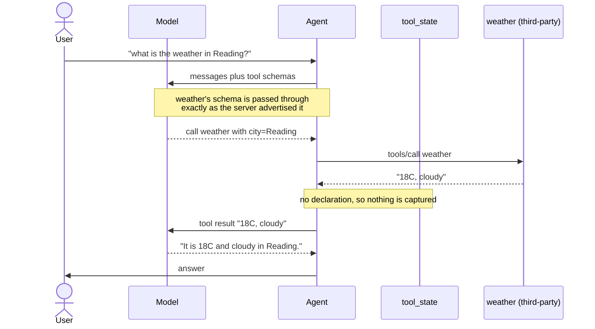
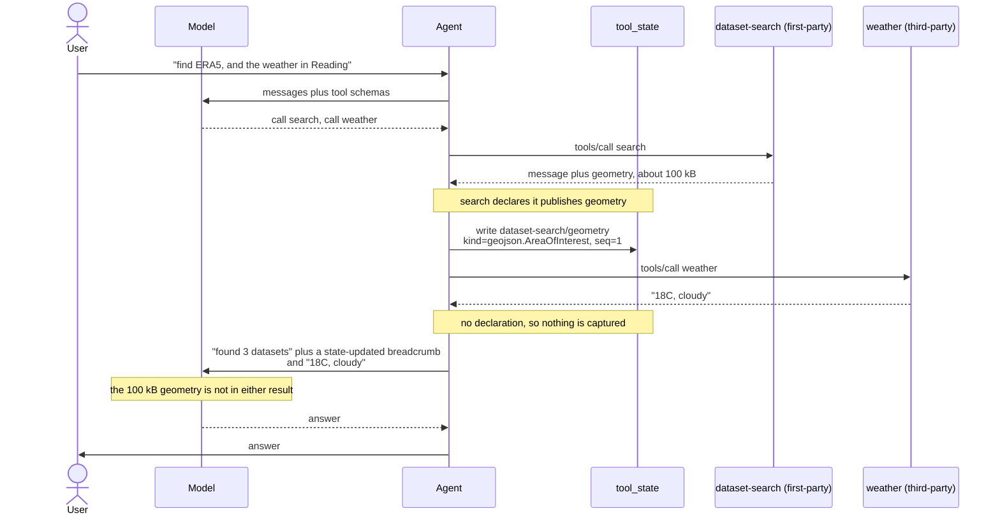
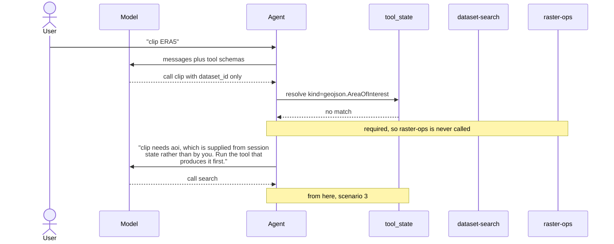

# Session state: what the model never sees

Some tool inputs and outputs are bulk data the model has no business handling:
a clip geometry, an item collection, a raster footprint. Asking a model to
produce one burns tokens on a value it can only copy imperfectly; letting one
back into the transcript burns tokens on every subsequent turn.

`mcp_runtime.injected` is how a **server** declares what it exchanges with
session state. `mcp_state` is what a **client** does about it. Between them,
a value moves from the tool that produced it to the tool that needs it without
passing through the model at all.

Two declarations, both read off the tool's own signature and advertised in its
MCP `_meta`:

```python
class SearchDatasetsResult(ToolResult):
    geometry: NotRequired[Annotated[FeatureCollection, Kind(GEOJSON_AREA_OF_INTEREST)]]


@tool
async def clip_raster(
    dataset_id: str,
    aoi: Annotated[FeatureCollection, Injected(kind=GEOJSON_AREA_OF_INTEREST)],
) -> ClipResult | ToolError: ...
```

Resolution is by **kind**, never by key or server, so the producer and the
consumer can be different toolsets on different MCP servers that know nothing
about each other. Storage keys are namespaced by toolset
(`dataset-search/geometry`) purely so two toolsets choosing the same field name
cannot overwrite each other.

The scenarios below are in increasing order of involvement. The first is the
baseline: nothing here changes how an ordinary MCP server behaves.

---

## 1. A third-party server, which declares nothing

The common case, and the one to establish first. A server that carries no
`_meta` declarations is untouched in both directions: `bind_injected` returns
its tools by identity, and the capture middleware has no entry for them.



Every argument comes from the model and every result goes back to it. This is
plain MCP, and it stays plain MCP.

---

## 2. A first-party server alongside it

Now one toolset publishes. The point of this diagram is the **isolation**: the
geometry lands in `tool_state`, and the third-party server neither contributes
to it nor receives anything from it.



The model is told *that* a geometry exists, by the breadcrumb, and can read it
on demand with `inspect_state` if it needs to reason about it. It is not
handed it.

---

## 3. One first-party tool consuming another's output

The payoff. `raster-ops` needs an area of interest; `dataset-search` published
one; neither names the other.


The model emitted `dataset_id` and nothing else. The geometry crossed from one
server to another through the agent, and appears in no message in the
conversation.

---

## 4. Nothing has published it yet

The first thing you hit in practice. A required injected parameter with no
match does not call the server — it returns an error written for the model,
because the model is the only party that can fix it.



---

## Trust

Everything above is driven by declarations a server makes **about itself**,
and the client honours them unconditionally. A server that declares nothing is
inert, but participating is unilateral and free, so "does not follow the spec"
is not a security boundary — a hostile server can declare an injected
parameter to be handed state, or declare a published kind to write into it and
have another server's tool consume the result.

That is acceptable while every server behind the index is yours, which is the
only configuration this is built for today. If an index ever aggregates
third-party servers, the control to add is **per-connection**: filter which
server names may declare anything at all, once, where `published_keys` and
`bind_all_injected` are applied.

Secret-shaped field names (`token`, `api_key`, …) are refused at capture
regardless of what a server declares, but that is a backstop against a
mistake, not against a hostile server.
