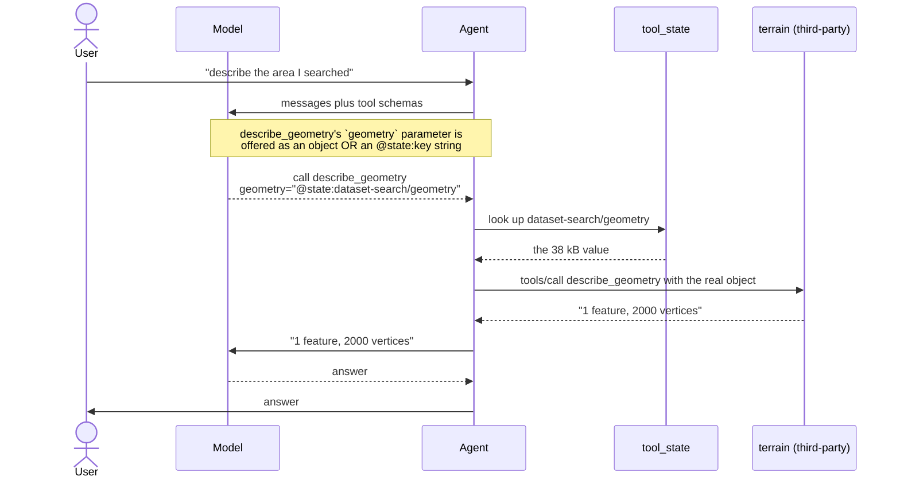
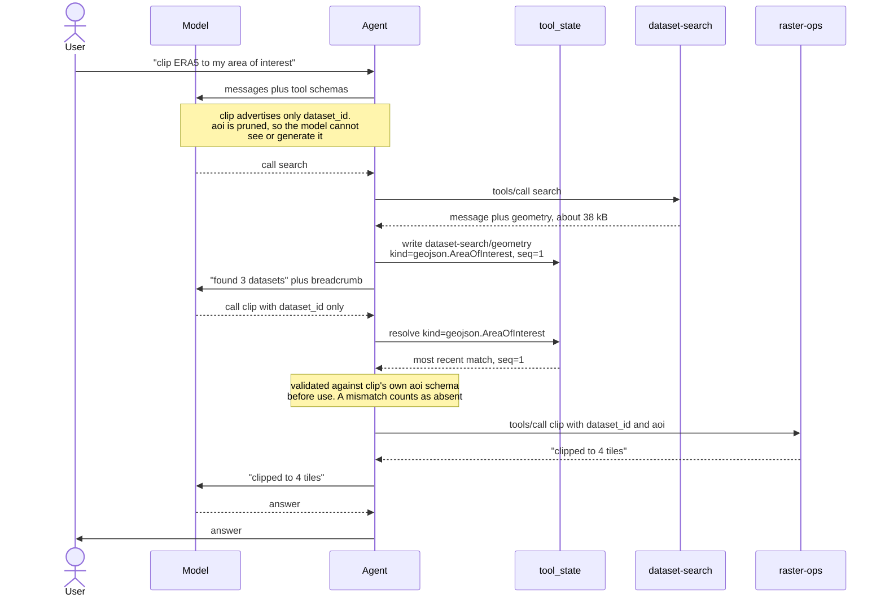

# Session state: what the model never sees

Some tool inputs and outputs are bulk data the model has no business handling:
a clip geometry, an item collection, a raster footprint. Asking a model to
produce one burns tokens on a value it can only copy imperfectly; letting one
back into the transcript burns tokens on every subsequent turn.

`mcp_state` moves such a value from the tool that produced it to the tool that
needs it, through agent state, without it passing through the model.

**It requires nothing of the servers involved.** A tool nobody annotated, on a
server that has never heard of this project, takes part. Declaring makes it
cheaper and safer; it does not make it possible.

All of it runs, against three real MCP servers — two of ours and one raw
FastMCP — in [`examples/session-state/`](../examples/session-state/). No API
key, nothing to start first.

---

## The general path: no declarations anywhere

Two halves, both entirely client-side.

**Capture by size.** Any field in a tool's `structuredContent` over
`DEFAULT_CAPTURE_BYTES` moves into `tool_state` under `<tool>/<field>`, and the
transcript gets a `[state updated: …]` breadcrumb instead. Values are labelled
by recognising their own shape (`mcp_state.detect`): GeoJSON carries
`"type": "FeatureCollection"`, a STAC ItemCollection adds `stac_version`, a
bounding box is four numbers. Anything unrecognised is stored unlabelled —
which is honest, and still useful.

**Handles.** Every parameter that could hold a bulk value — schema type
`object` or `array` — gains a second accepted form, `@state:<key>`. The model
reads the key off the breadcrumb, passes it in place of the value, and
`mcp_state.handles.dereference` swaps in the payload before the call. The
server receives an ordinary object and never knows.



The model spent about ten tokens naming a value instead of thousands
reproducing one. What it did *not* get is a guarantee: the parameter is still
in its schema, so a model determined to inline a geometry can. That is the
price of requiring nothing of the server.

### Why the client cannot just work it out

The obvious alternative — have the client decide which parameter wants state —
does not survive contact with a real schema. This is what an unannotated
`aoi: dict` actually advertises:

```json
"aoi": { "type": "object", "additionalProperties": true, "title": "Aoi" }
```

That matches every JSON object that has ever existed. Structural matching is
worthless for exactly the values this design exists to move; it only
discriminates for small things like `bbox`, which you least need to inject.

So the *value* side is inferable — a value is a concrete thing that can be
inspected — and the *parameter* side is not. A parameter is a hole. Rather
than guess, the general path asks the model, which is the only party with the
conversation in front of it when more than one stored value would fit.

---

## The accelerator: one tag, both directions

A server built on `mcp_runtime` can say what a value *is*, using the same
marker on either side of a tool:

```python
class SearchDatasetsResult(ToolResult):
    geometry: NotRequired[Annotated[FeatureCollection, Kind(GEOJSON_AREA_OF_INTEREST)]]


@tool
async def clip_raster(
    dataset_id: str,
    aoi: Annotated[FeatureCollection, Kind(GEOJSON_AREA_OF_INTEREST)],
) -> ClipResult | ToolError: ...
```

`Kind` names the semantic type and nothing else. It says nothing about where a
value comes from — that is the client's decision, made against everything it
actually connected to. A server cannot know whether some other toolset
publishes the kind its tool takes, so it does not try.

Given a tag, the client does better than the general path: it **removes the
parameter from the model's schema entirely** and fills it by matching the kind.
Zero tokens, no choice to get wrong, no turn spent.



Resolution is by kind, so the producer and consumer can be different toolsets
on different servers that know nothing about each other. Storage keys are
namespaced by toolset (`dataset-search/geometry`) purely so two toolsets
choosing the same field name cannot overwrite each other.

### The one thing only the tool knows

`Kind` takes a second argument:

```python
aoi: Annotated[
    FeatureCollection, Kind(GEOJSON_AREA_OF_INTEREST, model_generatable=False)
]
```

Everything else the client can work out for itself. This it cannot. A
2000-vertex catchment boundary and a four-number bounding box are both
"geometry", and only the tool author knows which a model could plausibly
produce. `model_generatable=False` says: if nothing publishes this kind, do not
let the model guess.

It defaults to `True`, because a parameter that stays in the schema degrades to
plain MCP — exactly what a client implementing none of this would do — and that
is nearly always better than deleting a usable tool.

Note what is *not* here. There is no `required=` flag: a parameter with a
Python default is optional in the tool's own `inputSchema`, which is precisely
the condition under which a client may leave it out of a call, so `required` is
read from the schema. Nothing to keep in sync, and nothing to police.

---

## When nothing publishes the kind

Two different situations, and only one of them is a problem.

**A publisher is connected but has not run yet.** Recoverable. The call does
not reach the server; the model gets an error written for it, because the model
is the only party that can fix it by running the producing tool first.

**Nothing connected publishes the kind at all** — a mistyped kind string, or a
toolset deployed without the one that feeds it. Unrecoverable, and worth
catching at connect:

```python
agent_tools, withheld = partition_usable(bind_all_injected(tools))
for item in withheld:
    log.warning("withholding %s", item)
```

What happens then depends on the tag and the tool's own schema:

| Parameter | Nothing publishes the kind | Why |
| --- | --- | --- |
| `Kind(…)`, required | model supplies it | degrades to plain MCP; the tool still works |
| `Kind(…)`, optional | model supplies it, or omits it | it was optional anyway |
| `Kind(…, model_generatable=False)`, required | **tool is withheld** | a 38 kB geometry is better as a missing tool than a confident fake |
| `Kind(…, model_generatable=False)`, optional | omitted from the call | the tool picks its own default — a full extent, say |

`unsatisfiable(tools)` returns the full picture, each entry carrying whether it
is `fatal`. `raise_unsatisfiable(tools)` refuses to start instead, for a
deployment where a missing wire should never be tolerated.

This is deliberately a check on the **wiring**, not on membership of
`mcp_runtime.kinds`. A kind is just a string on the wire, so a consumer repo
can mint its own without this package knowing about it — and a typo still gets
caught, because a kind nobody publishes is a kind nobody publishes.

The earliest point this can run is **connect time, in the client**. A server
validating its own tools can't distinguish "nobody produces this" from "the
producer lives in another toolset" — consuming another toolset's output is the
whole point. Toolsets do advertise both halves on `/health` (`state.produces`
and `state.consumes`), which the index aggregates, but that describes what is
*deployed*; only the client knows what it actually connected to.

---

## When two publishers match

Kind resolution takes the most recently published entry, which is almost always
the one in play — the AOI a user just searched with, not the one from four
turns ago. But nothing stops two toolsets publishing the same kind, and then
recency is a guess: a search AOI and a result footprint are both GeoJSON, and a
clip tool handed the wrong one produces confident nonsense.

**Make the kinds distinct.** This is why the vocabulary separates
`GEOJSON_AREA_OF_INTEREST` from `GEOJSON_FOOTPRINT` — if two values are not
interchangeable, they are not the same kind, and the ambiguity disappears.

Where they genuinely are the same kind, the general path is the escape hatch:
drop the tag and let the model pass a handle. It knows which one the user
meant, and recency does not.

---

## Trust

Everything above is driven by declarations a server makes **about itself**, and
the client honours them unconditionally. A server that declares nothing is not
inert any more — its large returns are captured and its bulk parameters accept
handles — but participating is unilateral and free either way, so "does not
follow the spec" was never a security boundary. A hostile server can tag a
parameter and be handed state, or declare a published kind to write into state
and have another server's tool consume the result.

Undeclared capture widens this a little: a large value from any connected
server can be reached by handle, so a server need not declare anything to get
its output in front of another tool. The model has to name it, which the
transcript records — that is visibility, not control.

That is acceptable while every server behind the index is yours, which is the
only configuration this is built for today. If an index ever aggregates
third-party servers, the control to add is **per-connection**: filter which
server names may take part at all, once, where `publications` and
`bind_all_injected` are applied.

Secret-shaped field names (`token`, `api_key`, …) are refused at capture
regardless of what a server declares or how large the value is, but that is a
backstop against a mistake, not against a hostile server.
