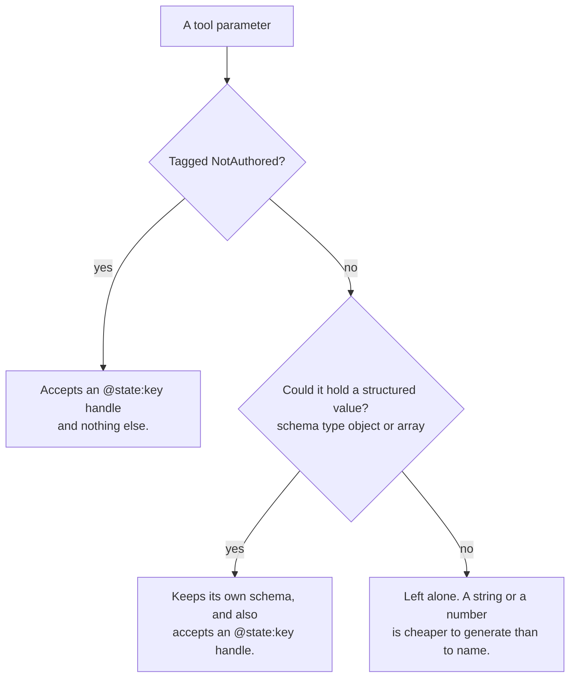
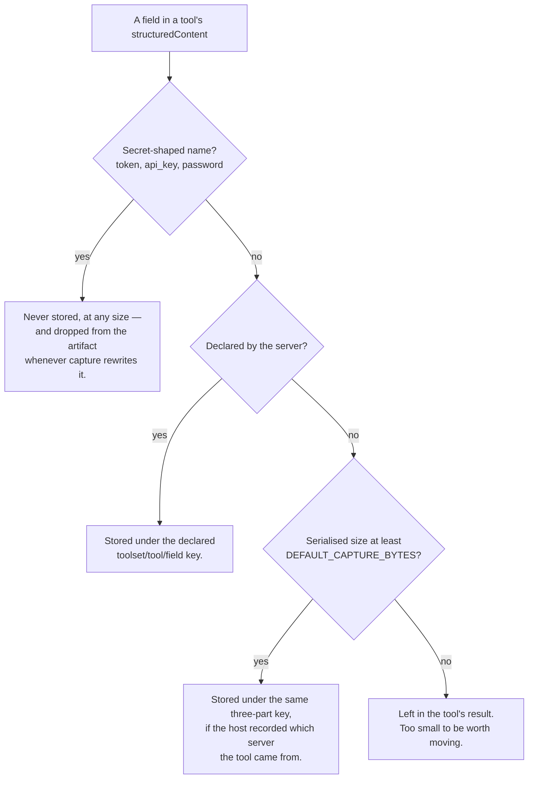

# Session state: what the model never sees

Some tool inputs and outputs are too large for the model to be handling:
a clip geometry, an item collection, a raster footprint. Asking a model to
produce one burns tokens on a value it can only copy imperfectly; letting one
back into the transcript burns tokens on every subsequent turn.

`mcp_state` moves such a value from the tool that produced it to the tool that
needs it, through agent state, without it passing through the model.

## The promise

**A large value is stored once, named cheaply, and never re-enters the
conversation.** The model is told a value exists and what produced it; it
decides which one a call should use; the client substitutes the payload on the
way to the server.

Three things follow from "the model decides":

1. **The model must be able to say what it wants, cheaply.** Every parameter
   that could hold a structured value gains a second accepted form — the string
   `"@state:dataset-search/search_datasets/area_of_interest"`, a **handle**
   naming something already stored. About ten tokens instead of 38 kB.
2. **What is stored must be legible.** A key is
   `<toolset>/<tool>/<field>`, and the listing a model chooses from adds the
   value's shape and the tool that published it. Nothing labels a value with
   what it *means*: an area of interest and a coverage footprint are the same
   JSON, and the only thing that tells them apart is the name its tool gave it.
3. **A wrong choice must be correctable.** A handle naming nothing, or a value
   a model wrote where it may not, comes back as a refusal addressed to the
   model — a tool *result*, listing what session state actually holds — not as
   an exception that ends the run.

A tool may add one thing: **`NotAuthored`** on a parameter, meaning *a model
must not write this value*. That narrows the parameter's schema so a handle is
the only form it accepts. It names no type, so no two toolsets have to agree on
anything, and it is not a claim about session state at all — a client that
ignores it runs the tool exactly as before.

All of this is client-side, so it exists only where `mcp_state` is wired in.
The same servers connected to an MCP host that does none of it behave exactly
as they always did.

### What a handle is

A string, in place of a value, on the way to a tool:

```
@state:dataset-search/search_datasets/area_of_interest
```

`offer_handles` rewrites the parameter's JSON Schema so both forms validate:

```json
{"anyOf": [
  {"type": "object", "…": "the server's own schema"},
  {"type": "string", "pattern": "^@state:", "description": "A session-state reference…"}
]}
```

`dereference` swaps it for the stored value before the call goes out, so the
server receives the real thing and never knows. A parameter its server tagged
`NotAuthored` gets the handle arm **alone** — no `anyOf`, no literal accepted.

The model learns which keys exist from the `[state updated: …]` breadcrumb
capture leaves on a tool result, and can read any of them with `inspect_state`.

### A handle only counts as a whole argument

`dereference` substitutes a handle only where one *is* an argument, never
inside one. A model writing `{"request": {"area": "@state:…"}}` on a tool
taking an opaque `dict` gets no substitution — the server would receive the
literal string.

That is caught rather than sent: `unresolved()` walks the arguments for any
`@state:` left standing, and the call is refused with the path named
(`request.area`) and the available keys listed. The same check catches a handle
naming a key that does not exist.

## How a parameter is decided

Once, at connect, for every parameter of every connected tool:



**"Structured" is a test on the declared type, not on any value's size** —
this runs at connect, when no tool has produced anything to measure. `object`
and `array` qualify; `string`, `number` and `boolean` do not, since naming a
short value costs a model no less than emitting it. A parameter with no stated
type, or one behind a `$ref` or an `anyOf`, also qualifies: unconstrained means
it could hold anything. The test errs towards yes, because a false yes costs a
few schema tokens and a false no silently withdraws the mechanism from a
parameter that needed it.

**Nothing is withheld at connect.** A `NotAuthored` parameter whose value
nothing has published yet still gets offered — the producer may run later in
the same turn, and a client cannot know at connect what will have run by the
time a call is made. The call is answered with a refusal instead, which the
model can act on.

## How a returned value is captured

After every tool call:



"Declared" needs no work from a tool author: **every data key of a
`ToolResult` — every field but `message` — is one**. Being structured data
rather than prose is the whole declaration, and `with_state_meta` stamps the
resulting keys into the tool's `_meta` for a client to read back.

The payload is gone from the transcript; what stands in its place is whatever
the tool put in `message`, plus a `[state updated: …]` breadcrumb naming the
key. The size gate is an argument, not a constant:
`StateCaptureMiddleware(capture_undeclared=…)` takes a different threshold, or
`None` to capture only what a server declared.

### A data key is a public name

The key a value lands under is what a model reads to decide whether to reuse
it. `dataset-search/search_datasets/area_of_interest` says which toolset, which
call, and what the value is — and the last part is a name its author chose.

Name it for what the value **is**, not for its type. `geometry` is a poor name
because a footprint is also a geometry; `area_of_interest` and `footprint` are
good ones, because a model reading either knows which tool it belongs in. This
is the whole of the cross-toolset contract: two toolsets that share no code and
no imports agree on nothing but this string, and a model bridges them.

## Receipts: what a call actually ran against

A handle names a value without describing it. By the time a host renders the
call, `@state:dataset-search/search_datasets/area_of_interest` is just a
string — nothing in the transcript says what it held or who put it there.

So every parameter session state supplies leaves a **receipt** on the tool
message's artifact, under `injected_state`:

```json
{"aoi": {"key": "dataset-search/search_datasets/area_of_interest",
         "tool": "search_datasets"}}
```

This is a **host-side** record: LangChain sends a tool message's `content` to
the model, never its `artifact`, so nothing here costs context. It rides the
message into the checkpointer and comes back on a later turn;
`receipts_of(message.artifact)` is how a host reads it, and what `mcp_agent`
builds its tool-step input from. `mcp_agent_api` forwards each one as a
`state.consumed` activity — still no context cost, because that goes to the
client and never back to the model.

**Nothing is echoed to the model.** It wrote the key itself, so repeating it
would buy nothing the transcript does not already hold.

How the model learns any of this exists is a system prompt, and it ships as a
reusable fragment: `mcp_state.SESSION_STATE_PROMPT` explains the breadcrumbs,
the handles, the narrowed parameters and `inspect_state`, and asks the model to
carry provenance into its answers — "clipped with the area of interest that
search_datasets returned", not just "clipped". The bundled agent appends it to
its own instruction; a host with its own prompt does the same (see
`docs/CONSUMING.md`).

## Provenance: what a call was given

A tool owns what it returns. Nothing here inspects a return to decide whether a
value was genuinely derived or merely echoed back — an equality test against the
call's arguments would catch the echo and miss every transformation, producing a
label that is *sometimes* right with no way for a reader to know which time.

What the client knows for certain is where each **argument** came from. A handle
is a reference to a value some tool produced; anything else the model wrote this
turn. So every entry records the call that produced it:

```python
class StateEntry(TypedDict):
    value: Any
    tool: NotRequired[str]
    seq: NotRequired[int]
    #: parameter -> the tool_state key it came from, or "model"
    inputs: NotRequired[dict[str, str]]
    #: how many *different* values this key has held; absent means one
    versions: NotRequired[int]
```

Parameter names and state keys, never values, so it stays cheap however large
the call was. Absent where the call took no arguments, which is not the same
claim as an empty object.

### Why this is the hole worth plugging

`NotAuthored` stops a model writing a value *into that parameter*. It does not
stop this:

1. The model invents `[12.4, 55.6, 12.7, 55.8]`.
2. It passes that to some tool with an ordinary, untagged `bbox` parameter.
3. That tool returns `bbox` in its `ToolResult`.
4. Capture stores it as `gazet/get_aoi/bbox`, `tool="get_aoi"`.
5. The model passes `@state:gazet/get_aoi/bbox` to a `NotAuthored` parameter.

The invented value now wears a tool's name and is indistinguishable from a
gazetteer lookup. `inputs` is what tells them apart — the first case records
`{"bbox": "model"}`, the second `{"place": "model"}` with a bbox the tool
actually computed.

### A chain, not a taint

Each recorded input names either the model or **another key**, and that key's
entry carries the same record. So a value's history is a walk over facts:

```
raster-ops/clip_raster/bounds     given {dataset_id: model, aoi: dataset-search/search_datasets/area_of_interest}
  dataset-search/…/area_of_interest  given {query: model}
```

Nothing propagated a flag and nothing compared two values. That is also why
there is no false-positive policy to get wrong: taint propagation has to decide
how far a mark spreads and gets it wrong for somebody, while a chain decides
nothing and lets each reader stop where it wants to.

**Anything in this package stops at one level** — the call that produced the
entry being read. Deeper is available and a host is free to walk it, but at
depth "the model wrote something upstream" is true of every value in a session:
it wrote the query that found the dataset.

### What reads it

**The listing**, which is what a refusal puts in front of the model:

```
@state:gazet/get_aoi/bbox — 4 item(s), from get_aoi (you wrote: bbox)
```

Only model-authored parameters are named. A parameter filled from state is the
unremarkable case and would cost tokens on every line.

**The host**, in a tool step: `… · from get_aoi · bbox written by the model`.
**The wire**, as `inputs` on each key of the state channel and on
`GET /threads/{id}/state/{key}`. **The model**, via `SESSION_STATE_PROMPT`,
which asks it to prefer a value that does not carry the caveat and to say so
when a result depends on one.

**Nothing refuses on it.** Enforcing was considered and rejected: it turns
visibility into a guarantee at the price of a tool going uncallable whenever
its only producer was itself called with a model-authored argument, and that
lands on a user with no way to clear it. A wrong value the user can see beats a
right one they cannot obtain.

## Reading a key as it stood earlier

A key holds one value. When a later call republishes it, the earlier value
leaves state — and a model asked "how does this compare with the one you found
first" reads the key, gets a well-formed answer, and compares the current value
with itself. The read succeeds, so nothing looks wrong.

Two things address it, and the first is what makes the second get used.

**A read says when its key has held other values.** `merge_tool_state` counts
them as it merges, so the count is on the entry the model is looking at rather
than derived from anywhere:

```
inspect_state("gazet/get_aoi/bbox")
[9.9, 56.1, 10.3, 56.2]
[this key has held 2 different values in this session; the above is the
current one. Pass turn=<n> to read it as it stood at the end of an earlier
turn, counting the user's questions from 1.]
```

and the key listing carries the same signal: `list[4] of 9.9 — rewritten, 2
versions`. A value republished *unchanged* does not count, so the word stays
worth reading.

**`inspect_state(key, turn=N)` reads the key as that turn left it.** Nothing
new is stored for this: a host running the agent under a checkpointer already
retains every past `tool_state`. What it supplies is a `ThreadHistory` —

```python
class ThreadHistory(Protocol):
    async def snapshots(self, thread_id: str) -> Snapshots: ...


class Snapshots:
    turns: Mapping[int, Mapping[str, StateEntry]]  # 1-based, sparse
    total: int  # how many the thread has had
```

Keys and entries, nothing else. `mcp_state` has never known about threads,
checkpoints or retention and still does not; `total` alongside `turns` is what
lets it tell a turn the thread never had from one that has been pruned without
knowing what a checkpointer is.

`mcp_agent` supplies `CheckpointHistory`, built from the checkpointer
`with_session_state` is already handed — so a host that passes one gets this
and a host that does not keeps today's behaviour, with `turn=` answering that
the deployment retains no turn history rather than raising.

Three answers, deliberately distinct:

| | what the model is told |
| --- | --- |
| retained | the value, as of the end of that turn |
| never existed | how many turns the conversation has had, to count against |
| pruned | **the value existed and is gone** |

The last one is the reason the distinction is worth carrying. "I cannot answer
that, the earlier value is no longer retained" is a good answer. Silently
comparing a value with itself is not.

The same question over HTTP is `GET /threads/{id}/state/{key}?turn=N`, and both
are now one derivation of what a turn is (`mcp_agent.history`).

---

# The scenarios

Four, and they differ only in what the two servers said about themselves.
Every one is exercised for real by `examples/session-state/demo.py`.

## A. A value crosses two toolsets that share nothing

`dataset-search` returns an `area_of_interest` data key. `raster-ops` has a
`clip_raster` whose `aoi` is tagged `NotAuthored`. Neither imports the other;
neither names the other.

```
search_datasets(query="rainfall")
  → "Found 3 datasets…  [state updated: dataset-search/search_datasets/area_of_interest]"

clip_raster(dataset_id="chirps-daily",
            aoi="@state:dataset-search/search_datasets/area_of_interest")
  → "Clipped chirps-daily to a 2000-vertex area of interest."
```

The 38 kB geometry was never in the transcript, and `clip_raster` could not
have been called with one the model wrote: its `aoi` accepts nothing but a
handle. The model spent about ten tokens on the key.

## B. Nothing declared anywhere — a third-party server

A raw FastMCP server, no `mcp_runtime`, no `_meta`. Its `describe_geometry`
takes a structured parameter; the client offers the handle branch alongside the
literal one, and the model points it at the same stored value. Its
`elevation_profile` returns a 54 kB array nobody declared, captured on size
alone.

Nothing on that server changed, and nothing about it was known in advance.

## C. The value has not been produced yet

The model calls `clip_raster` before running anything that publishes. The
schema accepts only a handle, so it writes one — and the key names nothing.

```
clip_raster was not called. 'aoi' takes a value that already exists in this
session; you cannot write one. Nothing has been published to session state
yet, so run the tool that produces this first.
```

Returned as a tool result, so the assistant message's `tool_calls` are all
answered and the transcript stays well-formed. The model runs a publisher and
retries. This is also what happens when a model batches a publisher and its
consumer into one step: LangGraph runs both against the state as it stood at
the *start* of the step, so the consumer cannot see the publication happening
beside it.

## D. The model tries to write the value anyway

Schemas are a request to a model, not a guarantee from it. A literal in a
`NotAuthored` parameter is caught before the call leaves the client:

```
clip_raster was not called. 'aoi' was given a value you wrote. It takes a
reference to a value some tool already produced. Pass @state:<key> naming one of:
  @state:dataset-search/search_datasets/area_of_interest — 1 feature(s), 2000 vertices, from search_datasets
  @state:terrain/elevation_profile/samples — 1200 item(s), from elevation_profile
```

## What tagging buys you

Nothing at all is required. A server that says nothing still has its large
returns captured and its structured parameters reachable by handle.

`NotAuthored` buys one thing, and it is the thing a schema cannot infer:
**a model may not author this value.** A 2000-vertex catchment boundary and a
four-number bounding box are both "geometry", and only the tool knows which of
them a model could plausibly produce — and for which of them a plausible-looking
invention is worse than no answer at all.

It degrades in three steps, by how much the client implements:

| client | effect |
|---|---|
| ignores `_meta` | the parameter behaves normally; the model fills it |
| reads the description | advisory — the served schema says the value must already exist |
| implements `mcp_state` | the schema accepts only `@state:<key>` |

## Sharp edges and limits

**A handle inside an argument is not substituted.** See "A handle only counts
as a whole argument" above. The refusal names the path, and points the model at
`inspect_state` to read the value and write the field itself.

**State is bounded.** `MAX_TOOL_STATE_BYTES` (8 MB of serialised values) evicts
oldest-first. A key that has been evicted resolves to nothing, and a handle
naming it is refused like any other missing key.

**Keys are last-write-wins.** Two calls of the same tool publishing the same
field overwrite each other; `seq` records the order, and the listing a model
reads is newest-first. The value that was displaced is not in state any more —
see [Reading a key as it stood earlier](#reading-a-key-as-it-stood-earlier) for
how a model reaches it and how it learns there was one.

**Two calls within one turn are indistinguishable.** Turn-scoped reads resolve
to the state a turn *ended* with, so a key written twice before the same answer
reads back as the second write at every turn that has it. The checkpoints could
tell them apart; a turn index cannot.

**Undeclared captures need the host's help to be keyed consistently.**
`langchain_mcp_adapters` accepts a `server_name` and records it nowhere on the
tool it builds, so a host that wants three-part keys for third-party servers
stamps it itself — `with_server_name` at load, `owners(tools)` into the
middleware. Without that they fall back to `<tool>/<field>`.

**Nothing knows what a value means.** Only its name says. A tool handed a
footprint where it wanted an area of interest will produce confident nonsense,
and no part of this will notice. Name data keys accordingly.

## Trust

**Every connected server is trusted.** Participating is unilateral and free, so
"does not follow the spec" is not a boundary. A hostile server can declare data
keys under a name chosen to be mistaken for another toolset's — the model picks
values by name, so a plausible name is the attack. Undeclared capture widens
this: a large value from any connected server can be reached by a handle
without declaring anything. The model has to name it, which the transcript
records, but that is visibility rather than control.

That is fine while every server behind the index is yours, which is the only
configuration this is built for today. The moment an index aggregates
third-party servers, the missing control is **per-connection**, not per-key:
filter which server names may take part at all, once, where `publications` and
`bind_all_injected` are applied.
