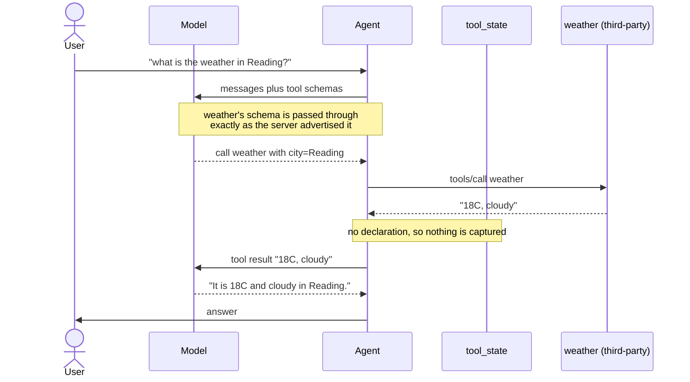
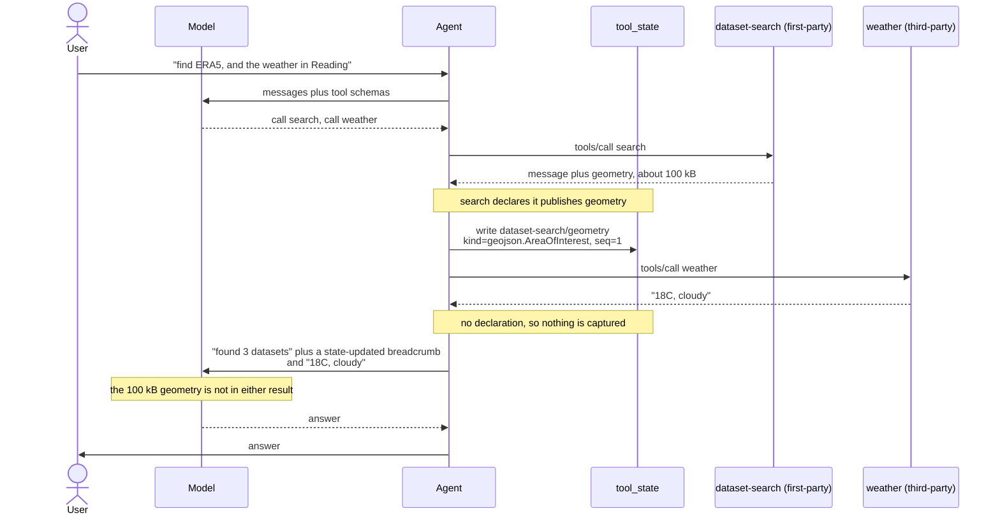
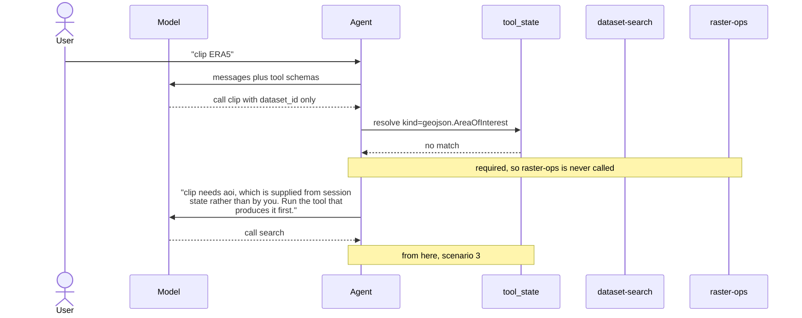

# Session state: what the model never sees

Some tool inputs and outputs are bulk data the model has no business handling:
a clip geometry, an item collection, a raster footprint. Asking a model to
produce one burns tokens on a value it can only copy imperfectly; letting one
back into the transcript burns tokens on every subsequent turn.

`mcp_runtime.injected` is how a **server** declares what it exchanges with
session state. `mcp_state` is what a **client** does about it. Between them,
a value moves from the tool that produced it to the tool that needs it without
passing through the model at all.

Two declarations, both read off the tool's own signature and advertised in its
MCP `_meta`:

```python
class SearchDatasetsResult(ToolResult):
    geometry: NotRequired[Annotated[FeatureCollection, Kind(GEOJSON_AREA_OF_INTEREST)]]


@tool
async def clip_raster(
    dataset_id: str,
    aoi: Annotated[FeatureCollection, Injected(kind=GEOJSON_AREA_OF_INTEREST)],
) -> ClipResult | ToolError: ...
```

Resolution is by **kind**, not by key or by server, so the producer and the
consumer can be different toolsets on different MCP servers that know nothing
about each other. Storage keys are namespaced by toolset
(`dataset-search/geometry`) purely so two toolsets choosing the same field name
cannot overwrite each other.

### When two publishers match

Kind resolution takes the most recently published entry, which is almost
always the one in play — the AOI a user just searched with, not the one from
four turns ago. But nothing stops two toolsets publishing the same kind, and
then recency is a guess: a search AOI and a result footprint are both
`geojson`, and a clip tool handed the wrong one produces confident nonsense.

Two ways out, in order of preference:

1. **Make the kinds distinct.** This is why the vocabulary separates
   `GEOJSON_AREA_OF_INTEREST` from `GEOJSON_FOOTPRINT` — if two values are not
   interchangeable, they are not the same kind, and the ambiguity disappears.
2. **Name the producer**, with `Injected(key="dataset-search/geometry")`. The
   escape hatch for when the kinds genuinely are the same and you need one
   specific publisher. It costs a name-level coupling to that toolset, so a
   renamed field breaks the consumer — caught at connect by the wiring check
   (below), not at runtime.

All of this runs, against two real MCP servers, in
[`examples/session-state/`](../examples/session-state/) — no API key, nothing
to start first.

The scenarios below are in increasing order of involvement. The first is the
baseline: nothing here changes how an ordinary MCP server behaves.

---

## 1. A third-party server, which declares nothing

The common case, and the one to establish first. A server that carries no
`_meta` declarations is untouched in both directions: `bind_injected` returns
its tools by identity, and the capture middleware has no entry for them.



Every argument comes from the model and every result goes back to it. This is
plain MCP, and it stays plain MCP.

---

## 2. A first-party server alongside it

Now one toolset publishes. The point of this diagram is the **isolation**: the
geometry lands in `tool_state`, and the third-party server neither contributes
to it nor receives anything from it.



The model is told *that* a geometry exists, by the breadcrumb, and can read it
on demand with `inspect_state` if it needs to reason about it. It is not
handed it.

---

## 3. One first-party tool consuming another's output

The payoff. `raster-ops` needs an area of interest; `dataset-search` published
one; neither names the other.


The model emitted `dataset_id` and nothing else. The geometry crossed from one
server to another through the agent, and appears in no message in the
conversation.

---

## 4. Nothing has published it yet

The first thing you hit in practice. A required injected parameter with no
match does not call the server — it returns an error written for the model,
because the model is the only party that can fix it.



---

## Wiring: when nothing can ever satisfy a parameter

Scenario 4 is the *recoverable* case — a publisher is connected, it just
hasn't run. The unrecoverable case is a parameter whose kind nothing connected
publishes at all: a mistyped kind string, or a toolset deployed without the
one that feeds it. Every call would raise, so the model should never be
offered the tool:

```python
agent_tools, withheld = partition_usable(bind_all_injected(tools))
for item in withheld:
    log.warning("withholding %s", item)
```

Withholding is the last resort, though — the declaration says which of four
outcomes applies, because they suit different values:

| Declaration | Nothing publishes it | Why |
| --- | --- | --- |
| `Injected(kind=…)` | tool is withheld | a 100 kB geometry is better as a missing tool than a silent token bill |
| `Injected(kind=…, required=False)` | omitted from the call | the tool picks its own default — a full extent, say |
| `Injected(kind=…, model_fallback=True)` | the model supplies it | small enough to be worth asking for, like a bounding box |
| *(publisher connected)* | n/a | injected from state, as scenarios 3 and 4 |

Each as a parameter, with the fourth form — naming one exact producer rather
than any publisher of a kind:

```python
# Default. Withheld from the agent when nothing publishes the kind.
aoi: Annotated[FeatureCollection, Injected(kind=GEOJSON_AREA_OF_INTEREST)]

# Optional. Omitted from the call instead, so the tool chooses for itself.
# The `= None` is not decoration: without a Python default the parameter stays
# required in the tool's own inputSchema, the client's omission is rejected
# server-side before the tool runs, and build_server refuses to serve it.
aoi: Annotated[
    FeatureCollection | None, Injected(kind=GEOJSON_AREA_OF_INTEREST, required=False)
] = None

# Fallback. Stays in the model's schema when nothing publishes the kind, so
# the tool keeps working at the cost of asking the model for a small value.
bbox: Annotated[list[float], Injected(kind=BBOX, model_fallback=True)]

# Exact key. Reads one named producer rather than resolving by kind — the
# answer to two publishers of the same kind, at the cost of coupling to that
# toolset's field name. See "When two publishers match" above.
aoi: Annotated[FeatureCollection, Injected(key="dataset-search/geometry")]
```

`model_fallback` is exactly what a client implementing none of this already
does: the parameter is in the advertised `inputSchema` either way, so leaving
it visible degrades to plain MCP rather than deleting a usable tool. It is off
by default because a parameter is usually marked injected *precisely* to stop
a model generating it.

`required=False` has one constraint the runtime enforces at startup: the
parameter needs a Python default, so the tool's own schema permits its
absence. Without one it stays required in `inputSchema`, and the call the
client carefully omitted it from is rejected server-side before the tool can
choose anything.

`unsatisfiable(tools)` returns the full picture, each entry carrying whether
it is `fatal`. `raise_unsatisfiable(tools)` refuses to start instead, for a
deployment where a missing wire should never be tolerated.

This is deliberately a check on the **wiring**, not on membership of
`mcp_runtime.kinds`. A kind is just a string on the wire, so a consumer repo
can mint its own without this package knowing about it — and a typo still gets
caught, because a kind nobody publishes is a kind nobody publishes.

The earliest point this can run is **connect time, in the client**. A server
validating its own tools can't distinguish "nobody produces this" from "the
producer lives in another toolset" — consuming another toolset's output is the
whole point. Toolsets do advertise both halves on `/health` (`state.produces`
and `state.injects`), which the index aggregates, but that describes what is
*deployed*; only the client knows what it actually connected to.

---

## Trust

Everything above is driven by declarations a server makes **about itself**,
and the client honours them unconditionally. A server that declares nothing is
inert, but participating is unilateral and free, so "does not follow the spec"
is not a security boundary — a hostile server can declare an injected
parameter to be handed state, or declare a published kind to write into it and
have another server's tool consume the result.

That is acceptable while every server behind the index is yours, which is the
only configuration this is built for today. If an index ever aggregates
third-party servers, the control to add is **per-connection**: filter which
server names may declare anything at all, once, where `publications` and
`bind_all_injected` are applied.

Secret-shaped field names (`token`, `api_key`, …) are refused at capture
regardless of what a server declares, but that is a backstop against a
mistake, not against a hostile server.
